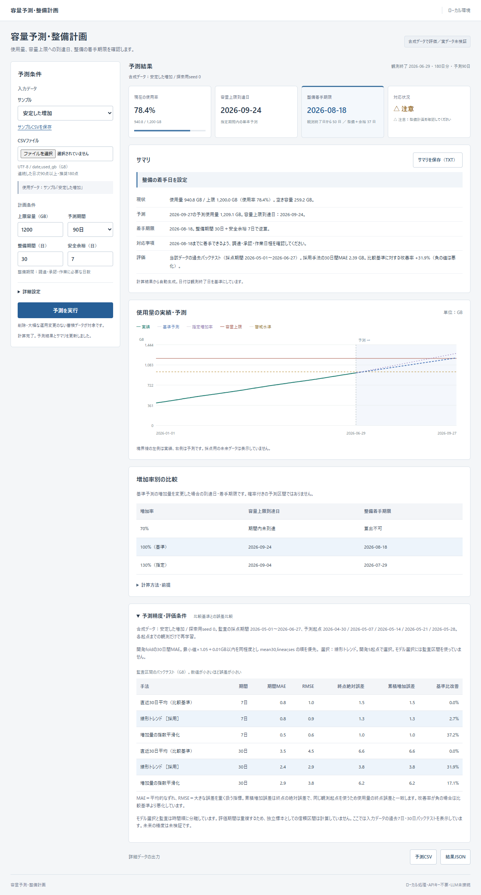

# 容量予測・整備計画

使用量の増加から「容量不足の見込み日」と「整備に着手する期限」を表示する、日本語のローカルWebアプリです。**合成データで評価／実データ未検証**。銀行などの実務精度を示すものではありません。

入力条件と予測結果を分けた業務用UIです。現状・予測・着手期限・対応事項・過去評価のサマリを表示し、TXT／JSONで保存できます。サマリは既存の計算結果から生成するため、追加データやAPIキーは不要です。



## 起動（Windows / PowerShell）

Python 3.14.3で確認。WSL・Docker・Node.js・APIキーはアプリの起動に不要です。依存の初回インストールにはインターネット接続が必要ですが、起動後のアプリは外部サービスやCDNへ通信しません。

```powershell
cd C:\Users\morim\dev\capacity-forecast
python -m venv .venv
.\.venv\Scripts\python -m pip install -r requirements.txt
.\.venv\Scripts\python run.py
```

[http://127.0.0.1:5000](http://127.0.0.1:5000) を開きます。終了はサーバーのターミナルで Ctrl+C。既に仮想環境を作成済みなら最後の1行だけで起動できます。PowerShellの実行ポリシーを変更する必要はありません。

Flaskの開発サーバーを127.0.0.1だけにバインドしています。公開・ログイン・クラウド配置は初版の対象外です。[Flask公式の起動方法](https://flask.palletsprojects.com/en/stable/quickstart/)に従っています。

## 試し方

1. サンプル「安定した増加」を選び「予測を実行」を押します。
2. 現在の使用率、容量不足日、着手期限を確認します。着手期限＝到達日−整備期間−安全余裕です。
3. 上限を1000GBに変えて再計算すると、整備期間を逆算した期限超過を確認できます。9999GBなら期間内未到達です。
4. サマリの対応事項と「増加率別の比較」を確認します。「予測精度・評価条件」では比較基準より悪い結果も表示します。
5. 「サマリを保存（TXT）」で報告用の文章を保存します。結果JSONにも同じサマリを含み、予測CSVも保存できます。サンプルCSVはダウンロード後、そのまま取込に使えます。

条件変更後や入力エラー時は、古い結果の出力を停止します。「予測を実行」で再計算してください。警戒水準と比較用の増加率は「詳細設定」にまとめています。CSVを選択した場合はCSVを優先し、使用中の入力元を表示します。「ファイル選択を解除」でサンプルへ戻せます。

日付の基準は**PCの今日ではなく、CSVの最終観測日**です。デモの観測期間は2026-01-01〜2026-06-29、180日です。休日を除かない暦日で逆算します。既に満杯の場合は最終観測日を到達済みの基準日とし、実際に最初に満杯になった過去の日付を推定する機能はありません。

## 入力と対象

```csv
date,used_gb
2026-01-01,400.0
2026-01-02,403.2
```

UTF-8、列順は `date,used_gb`、単位GB、連続した日次90〜3650点（推奨180点）、2MB以内です。重複、欠損日、無限値、非数値、負値、減少を拒否します。月次6点を日次に水増ししません。列名や単位文字の不一致は拒否できますが、GBと書かれた数値が実際にはMBかどうかは値だけから検出できません。

観測データは変更せず、削除や大幅な運用変更のない蓄積を対象にします。CSVの内容をファイルやDBに保存する機能はありません。予測結果のJSONには入力履歴も含まれます。

## 予測と評価

- 比較基準：直近30増分（31観測点）の平均を維持。
- 線形トレンド：全観測のOLS傾きを使い、最終実績を起点に積み上げて不連続を防止。
- 指数平滑化：日次増分、α=0.2、初期値は最初の増分。トレンド・季節性は追加しません。
- 将来の増分は0以上に制約します。有効な非減少入力では基本的に制約が発動しません。
- 同じ観測・起点・採点日で比較し、開発30日間MAEが最良値×1.05＋0.01GB以内なら上記の順に単純な候補を優先します。

180点の場合、1〜120日を開発、121〜180日を監査に分離。開発起点は60/67/74/81/88、監査起点は120/127/134/141/148です。各起点の直後7/30日を採点します。最後に180点で再学習して未使用の未来90日を予測します。モデルを最終結果に合わせて調整しません。

90〜149点のCSVは開発foldを確保できないため比較基準を固定し、監査だけを実施します。150点以上では開発foldを最大5個使い、少ない場合はUIで注記します。内部foldは60点から学習する小標本条件です。長いCSVでは末尾60日を監査用とし、その前の最大5起点で選択します。

詳細：[評価設計と結果](docs/evaluation.md)、[リーク監査](docs/leakage-audit.md)、[Claudeによる独立レビュー](docs/claude-review.txt)、[今回のUI・サマリ変更](docs/business-ui.md)、[最新UI検証記録](docs/verification/business-ui/ui.json)。

## 再現

合成データは6シナリオ（安定・加速・曜日差・構造変化・突発登録・停滞）。探索seed 0〜4、最終seed 100〜119を使用。シナリオごとに乱数ストリームを分けています。観測180日と採点用未来90日は別ファイルです。

```powershell
# 同じ設定・依存で同じCSVを生成（既存のデモを上書きします）
.\.venv\Scripts\python -m scripts.generate_demo

# 任意設定は別ディレクトリへ。最終評価済みデータは変更しないでください
.\.venv\Scripts\python -m scripts.generate_demo --output data/custom --scenario burst --seed 42 --start 2026-01-01 --days 180 --future 90 --initial-gb 400 --daily-gb 3 --noise 0.35

# 監査・APIテスト
.\.venv\Scripts\python -m pytest -q -p no:faulthandler

# 最終評価時の版を、現在のUIを変更せず別フォルダへ展開
git worktree add --detach .evaluation-v1 evaluation-v1
Push-Location .evaluation-v1
..\.venv\Scripts\python -m evaluation.final verify --output evaluation/results/final-v1

# 同一実験の再現（結果を上書きせず別名へ保存。新しい独立評価ではありません）
..\.venv\Scripts\python -m evaluation.final freeze --output evaluation/results/reproduction-v1
..\.venv\Scripts\python -m evaluation.final run --output evaluation/results/reproduction-v1 --stage final
Pop-Location
```

採点前に設定・コード・データのSHA-256、seed、依存バージョンを保存します。凍結後の変更があれば採点を停止し、既存の採点記録は上書きしません。途中でプロセスが止まった場合もその記録を残し、別ディレクトリにfreezeしてから再実行してください。結果を見て設定を変える場合、その評価は開発結果へ降格し、**新しい未使用seed**を先に固定して最終評価をやり直す必要があります。

数値結果は再現できますが、処理時間・実行日時は毎回変わります。CSVとソースのハッシュはLF改行に正規化します。最終評価時の全ファイルはタグ `evaluation-v1` に保存しています。現在のブランチではUI・APIにサマリを追加したため、過去の全ソースハッシュとの照合は意図通り不一致になります。古い凍結記録を更新して一致させることはせず、上記のタグで再現します。予測・選択・期限計算・評価器・データは変更していません。

UI検証は任意の開発依存です。アプリの利用には不要です。

```powershell
.\.venv\Scripts\python -m pip install -r requirements-dev.txt
.\.venv\Scripts\python -m playwright install chromium
# 別ターミナルでrun.pyを起動してから
.\.venv\Scripts\python -m tests.ui_check
```

## 構成

`app/` はFlask・日本語HTML/CSS/JavaScript・ローカルSVGグラフ、`forecasting/` はCSV検証・予測・期限・説明、`evaluation/` はバックテスト・最終採点・凍結記録、`scripts/` は合成データ生成、`tests/` は監査・API・UI検証です。

`data/demo/observed/` は通常アプリ用、`truth/` は評価器だけが読む正解、`metadata/` は生成条件です。APIはサンプル名の許可リストを使い、truthやmetadataを配信しません。APIは `POST /api/forecast`（multipartフォーム）と `GET /api/sample/<name>` です。

## 限界と次の段階

合成データ6種は現実の業務環境を網羅しません。180日のデータで年周期は分からず、観測数だけで情報量や実務精度は判断できません。予測は突発イベント・制度変更・削除・将来の成長率変化を知りません。重複するfoldを独立サンプルとして信頼区間を作っていません。

条件別シナリオは確率付き予測区間ではありません。90日以内の未到達は将来の安全を保証しません。監査テストは特定の不変条件と入力境界を確認するもので、あらゆるリークや過学習がないという保証ではありません。

初版の数値・日付はPythonで計算し、説明は日本語テンプレートです。LLMは未接続で、API連携の実績とは表現しません。将来の説明接続用に `Explainer` と [入力スキーマ](docs/explanation-input.schema.json) を分離しました。為替予測・費用計算・LLM接続・公開運用は次の段階です。
